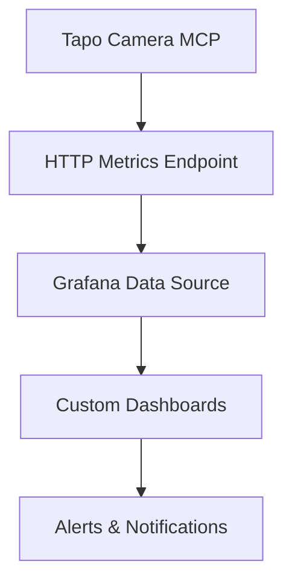

# Grafana Integration Overview - Tapo Camera MCP

**Status**: 🎯 Ready for Implementation  
**Priority**: ✅ High - Visual monitoring critical for security  
**Timeline**: 2-3 days implementation  

## What We're Building

Direct integration between **tapo-camera-mcp** and **Grafana** to create real-time security dashboards without complex middleware like MQTT or InfluxDB.

## Core Features

### 📊 Real-Time Dashboards
- **Live camera feeds** embedded in Grafana panels
- **Motion detection alerts** with visual timeline
- **Camera status monitoring** (online/offline, temperature, etc.)
- **Network performance metrics** (latency, connection quality)

### 🚨 Alert System
- Motion detection notifications
- Camera offline alerts
- Performance threshold warnings
- Integration with Grafana's alerting system

### 📈 Historical Data
- Motion event history
- Camera uptime statistics  
- Performance trends over time
- Storage usage monitoring

## Technical Approach

### Implementation Strategy
1. **Add metrics endpoint** to existing tapo-camera-mcp server
2. **Configure Grafana** to scrape metrics via HTTP/JSON
3. **Create dashboard templates** for common monitoring scenarios
4. **Set up alerting rules** for critical events

## Austrian Context Benefits

- **Kitchen monitoring** during cooking (timer integration)
- **Home security** while away (Vienna-specific crime patterns)
- **Package delivery** monitoring (common in apartment buildings)
- **Energy efficiency** tracking (Austrian sustainability focus)

## Implementation Phases

### Phase 1: Basic Metrics (Day 1)
- Camera status endpoint
- Motion detection data
- Basic Grafana connection

### Phase 2: Rich Dashboards (Day 2) 
- Custom panel development
- Alert configuration
- Visual enhancements

### Phase 3: Advanced Features (Day 3)
- Historical data persistence
- Performance optimization
- Documentation completion

## Next Steps

See `GRAFANA_INTEGRATION_DETAILED.md` for complete implementation guide including:
- Code examples and API specifications
- Grafana configuration steps
- Dashboard JSON templates
- Troubleshooting guide

---
*Ready for Windsurf IDE implementation - all architecture decisions finalized* 🚀
